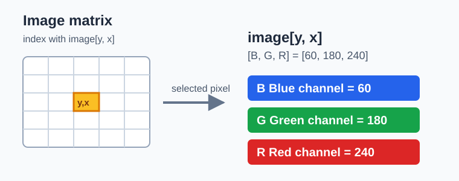

# 01 图像基础：矩阵、像素与 BGR

[教材目录](README.md) · [下一章：视频读取与处理](02-video-processing.md)

## 学习目标与前置知识

- 理解数字图像是由像素组成的 NumPy 数组。
- 会读取 `shape`、`dtype`，并按坐标读取一个像素。
- 明确 OpenCV 默认使用 BGR，而不是 RGB。

前置知识：Python 变量、列表和基本的 NumPy 概念。

## 核心理论

一张彩色图像可以看成三维数组：

```text
height × width × channels
  行       列       B,G,R
```

例如 `image.shape == (720, 1280, 3)` 表示图像高 720 像素、宽 1280 像素、有 3 个颜色通道。`dtype` 常为 `uint8`，所以每个通道的值范围是 0 到 255。

| 内容 | 含义 |
| --- | --- |
| `height` | 图像有多少行，坐标中的 `y` 方向 |
| `width` | 图像有多少列，坐标中的 `x` 方向 |
| `channels` | 灰度图通常为 1，彩色图通常为 3 |
| `uint8` | 无符号 8 位整数，范围为 0 到 255 |

OpenCV 中一个彩色像素的顺序是：

```text
image[y, x] = [blue, green, red]
                B      G      R
```

注意索引顺序是 `y, x`，先行后列；它与平面坐标书写的 `(x, y)` 正好相反。

## 图形化理解



上图左侧的网格就是图像数组：每一个小格是一个像素。选中一个像素后，右侧把它展开为三个数值。对 OpenCV 而言，`image[y, x]` 返回的是 **B、G、R** 三个通道，不是常见网页或 Matplotlib 中经常讨论的 RGB 顺序。

阅读图时记住两件事：

1. 网格的竖直方向是 `y`（行），水平方向是 `x`（列）。
2. 同一个 `(y, x)` 位置的三个通道共同决定该像素最终显示的颜色。

图：本仓库绘制的概念图。BGR 像素访问规则可对照 [OpenCV 官方图像矩阵说明](https://docs.opencv.org/4.x/d5/d98/tutorial_mat_operations.html)。

## 对应实践

对应脚本：[图像读取示例](../read_image.py)

在仓库根目录运行：

```powershell
python read_image.py
```

脚本从 `images/basics/test.jpg` 读取图像，检查读取是否成功，随后输出图像尺寸并显示原图。可以在读取后加入：

```python
print(image.shape)
print(image.dtype)
print(image[0, 0])
```

输入是 `images/basics/test.jpg`；输出是名为 `Image` 的窗口和终端中的图像信息。按任意键关闭窗口。

## 参数速查与常见误区

| 写法 | 作用 |
| --- | --- |
| `cv2.imread(path)` | 从路径读取 BGR 图像 |
| `cv2.imshow(name, image)` | 显示图像数组 |
| `image.shape` | 获得高、宽、通道数 |
| `image[y, x]` | 读取坐标 `(x, y)` 的像素 |
| `cv2.waitKey(0)` | 无限等待按键，保持窗口显示 |

常见误区：

- 把 OpenCV 的 BGR 当作 RGB，颜色会出现红蓝互换。
- 写成 `image[x, y]`，会读到错误位置，甚至越界。
- 不检查 `image is None`；路径错误时后续 `shape` 会报错。

## 复习卡

关键结论：图像是数组；坐标索引写作 `[y, x]`；OpenCV 彩色图默认是 BGR。

<details>
<summary>自测 1：<code>(480, 640, 3)</code> 分别表示什么？</summary>

高 480 像素、宽 640 像素、每个像素有 3 个颜色通道。
</details>

<details>
<summary>自测 2：为什么像素访问用 <code>image[y, x]</code>？</summary>

NumPy 二维数组先按行索引，再按列索引；行对应 y，列对应 x。
</details>

<details>
<summary>自测 3：<code>[255, 0, 0]</code> 在 OpenCV 的 BGR 中是什么颜色？</summary>

蓝色，因为第一个通道是 B（Blue）。
</details>

## 运行结果

`read_image.py` 显示读取到的原始 BGR 图像。


[教材目录](README.md) · [下一章：视频读取与处理](02-video-processing.md)
