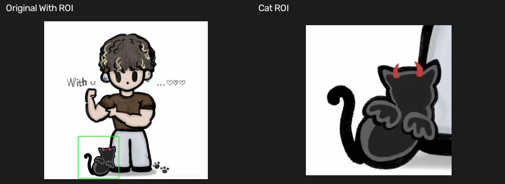
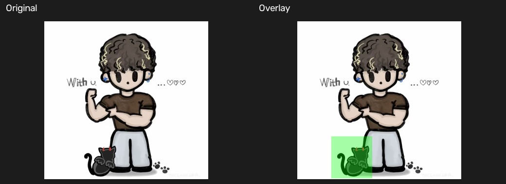

# 03 ROI 与图像叠加

[上一章：视频读取与处理](02-video-processing.md) · [教材目录](README.md) · [下一章：数值运算](04-numerical-operations.md)

## 学习目标与前置知识

- 理解 ROI（Region of Interest，感兴趣区域）的用途。
- 会使用 NumPy 切片提取矩形区域。
- 理解 `rectangle` 画框和 `addWeighted` 透明叠加的区别。

前置知识：图像数组、坐标 `(x, y)` 与数组索引 `[y, x]`。

## 核心理论

ROI 是图像中需要重点处理的一块区域。相比处理整张图，它能减少计算量并让任务更聚焦，例如只检测人脸、车牌或画面中央物体。

```text
完整图像
+----------------------------+
|                            |
|      +--------------+      |
|      |     ROI      |      |
|      +--------------+      |
|                            |
+----------------------------+
      x1,y1          x2,y2
```

NumPy 的切片写法是：

```python
roi = image[y1:y2, x1:x2]
```

切片的起点包含、终点不包含，因此 ROI 的宽高分别为：

$$width = x2 - x1, \qquad height = y2 - y1$$

透明叠加则先复制原图作为覆盖层，在覆盖层上绘制颜色标记，再按权重混合：

$$result = \alpha \cdot overlay + \beta \cdot image + \gamma$$

本仓库中 `overlay` 起初是原图副本，绿色矩形画在该副本上，再与原图混合；不是两张完全不变的原图相加。

## 对应实践

对应脚本：[ROI 示例](../ROI_example.py) · [透明叠加示例](../image_add.py)

```powershell
python ROI_example.py
python image_add.py
```

`ROI_example.py` 通过 `x1, y1, x2, y2` 定义范围，提取 ROI 并用矩形框标记原图。`image_add.py` 复制原图为 `overlay`，在其中的 ROI 位置画绿色实心矩形，再使用 `cv2.addWeighted` 与原图混合。

输入均为 `images/test.jpg`；输出为窗口显示。

## 参数速查与常见误区

| 写法 | 作用 |
| --- | --- |
| `image[y1:y2, x1:x2]` | 提取 ROI，注意 y 在前、x 在后 |
| `cv2.rectangle(image, pt1, pt2, color, thickness)` | 在图上画矩形 |
| `(0, 255, 0)` | BGR 绿色 |
| `thickness=-1` | 填充整个矩形 |
| `cv2.addWeighted(a, alpha, b, beta, gamma)` | 对两张同尺寸图做加权叠加 |

常见误区：

- ROI 的四个边界写反，或边界超过图像宽高。
- 以为 `rectangle` 默认绿色；颜色完全由 BGR 参数决定。
- 叠加的两张图尺寸或通道数不同，`addWeighted` 会报错。

## 复习卡

关键结论：ROI 是局部处理区域；切片写作 `[y1:y2, x1:x2]`；透明叠加混合的是原图和覆盖层。

<details>
<summary>自测 1：ROI 坐标为何写成 <code>image[y1:y2, x1:x2]</code>？</summary>

数组的第一维是行（y），第二维是列（x）。
</details>

<details>
<summary>自测 2：<code>(0, 255, 0)</code> 在 OpenCV 中为何是绿色？</summary>

OpenCV 颜色顺序是 BGR，三个值分别为蓝 0、绿 255、红 0。
</details>

<details>
<summary>自测 3：透明度由 <code>addWeighted</code> 的哪个参数主要控制？</summary>

由两个输入图像的权重 `alpha` 与 `beta` 控制；常见情况下两者之和为 1。
</details>

## 运行结果

第一个拼图显示原图与裁剪 ROI；第二个拼图显示半透明绿色 ROI 覆盖层与原图的混合结果。





[上一章：视频读取与处理](02-video-processing.md) · [教材目录](README.md) · [下一章：数值运算](04-numerical-operations.md)
