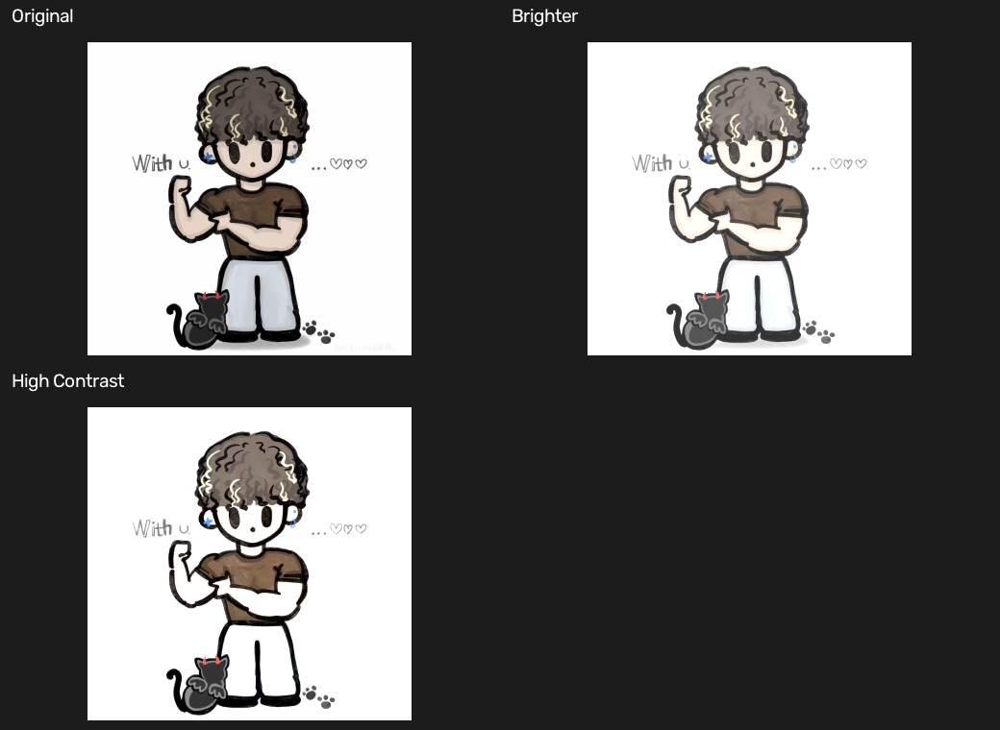
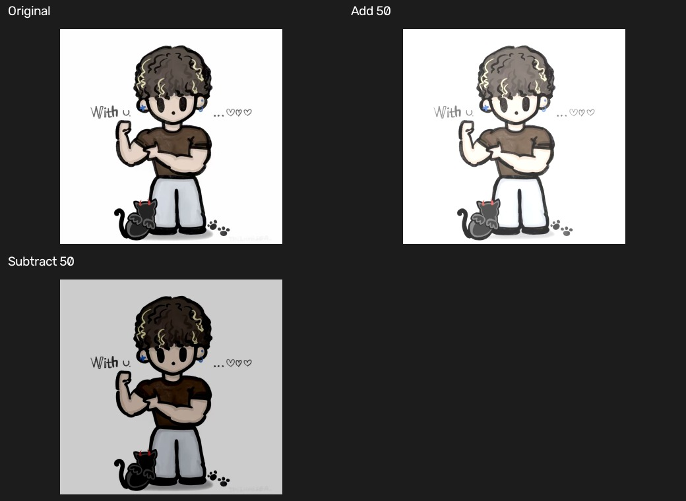

# 04 数值运算：亮度、对比度与归一化

[上一章：ROI 与图像叠加](03-roi-and-overlay.md) · [教材目录](README.md) · [下一章：预处理](05-preprocessing.md)

## 学习目标与前置知识

- 理解图像像素值的范围和 `uint8` 溢出风险。
- 区分 NumPy 运算与 OpenCV 饱和加减。
- 会用线性变换调节亮度、对比度，并理解归一化。

前置知识：像素是 0 到 255 的数值，彩色图有 BGR 三个通道。

## 核心理论

对 `uint8` 图像，像素合法范围是：

$$0 \le p \le 255$$

OpenCV 的 `cv2.add` 和 `cv2.subtract` 使用饱和规则：

```text
250 + 20 -> 255   （超过上限，截断为 255）
 10 - 20 ->   0   （低于下限，截断为 0）
```

常用亮度、对比度调整可写为：

$$g(x, y) = \alpha f(x, y) + \beta$$

其中 `alpha` 控制对比度，`beta` 控制亮度：

| 参数变化 | 视觉效果 |
| --- | --- |
| `alpha > 1` | 明暗差异被拉大，对比度增强 |
| `0 < alpha < 1` | 明暗差异被压缩，对比度降低 |
| `beta > 0` | 整体变亮 |
| `beta < 0` | 整体变暗 |

归一化是把原始范围线性映射到目标范围。例如将 $[min, max]$ 映射到 $[0, 255]$：

$$p' = \frac{p - min}{max - min} \times 255$$

它常用于让不同图像或不同处理中得到的数值更容易比较和显示。

## 对应实践

对应脚本：[数值基础示例](../numeric_basics.py) · [图像加减示例](../image_math.py)

```powershell
python numeric_basics.py
python image_math.py
```

`numeric_basics.py` 输出图像的尺寸、数据类型、最小值和最大值，并展示亮度与对比度变化。`image_math.py` 用 `np.full_like(image, 50)` 创建与原图同尺寸的常量图，再用 `cv2.add`、`cv2.subtract` 进行饱和加减。

输入是 `images/test.jpg`；输出为多个对比窗口及保存到 `output/` 的图像结果。

## 参数速查与常见误区

| 写法 | 作用 |
| --- | --- |
| `np.full_like(image, 50)` | 建立同尺寸、同数据类型、每个值为 50 的图像 |
| `cv2.add(image, value_image)` | 像素饱和相加 |
| `cv2.subtract(image, value_image)` | 像素饱和相减 |
| `cv2.convertScaleAbs(image, alpha, beta)` | 执行缩放、平移、绝对值并转为 8 位显示图 |
| `cv2.normalize(...)` | 将数据映射到指定范围 |

常见误区：

- 用 `uint8` 的 NumPy `+` 以为会自动截断；它可能发生 256 回绕。
- 把 `alpha` 和 `beta` 的作用混淆：前者主要改对比度，后者主要改亮度。
- 把归一化理解为“让图像更清晰”；它只是重映射数值范围，不会凭空创造细节。

## 复习卡

关键结论：OpenCV 加减默认饱和；`alpha` 控制对比度，`beta` 控制亮度；归一化是范围映射。

<details>
<summary>自测 1：为什么 <code>cv2.add</code> 比直接对 <code>uint8</code> 数组相加更适合图像亮度运算？</summary>

它对超出 0 到 255 的结果进行饱和截断，而不是发生数值回绕。
</details>

<details>
<summary>自测 2：将 <code>alpha</code> 从 1 调到 1.5，主要改变什么？</summary>

主要增大像素间的差异，即增强对比度。
</details>

<details>
<summary>自测 3：归一化会不会补回原图中已经丢失的纹理？</summary>

不会。归一化只重新分配已有像素值的范围。
</details>

## 运行结果

第一个拼图对比原图、增加亮度和提高对比度；第二个拼图对比 OpenCV 饱和加法与饱和减法。





[上一章：ROI 与图像叠加](03-roi-and-overlay.md) · [教材目录](README.md) · [下一章：预处理](05-preprocessing.md)
