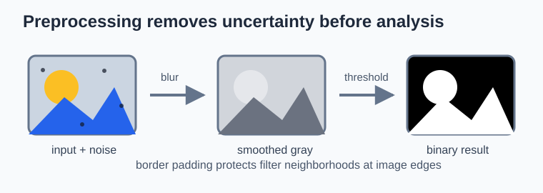
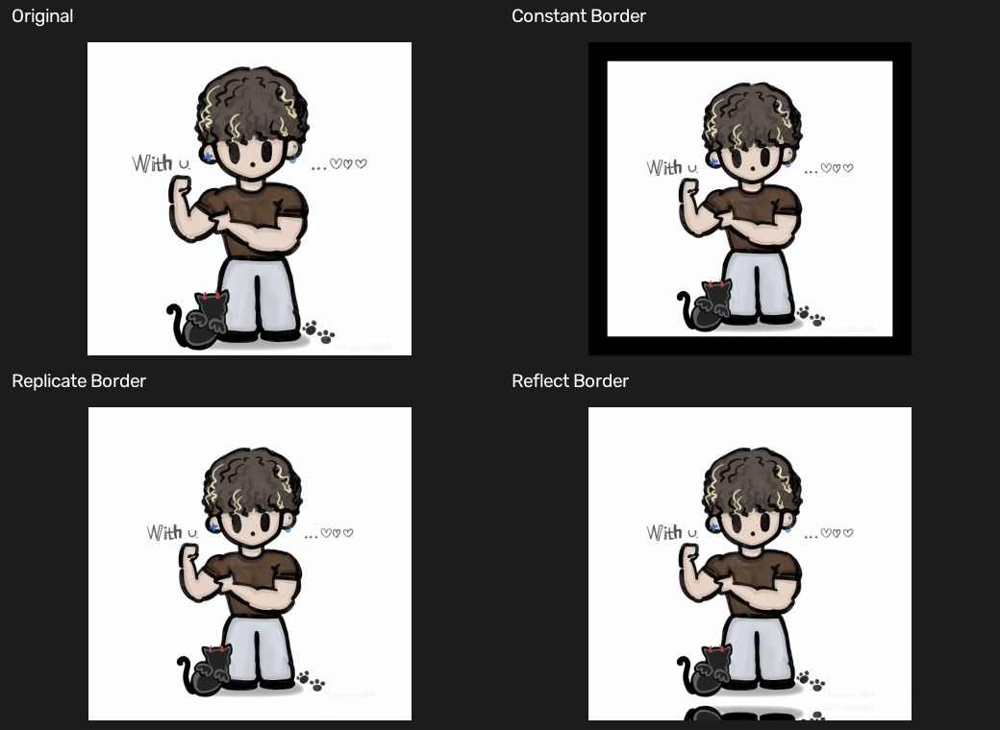
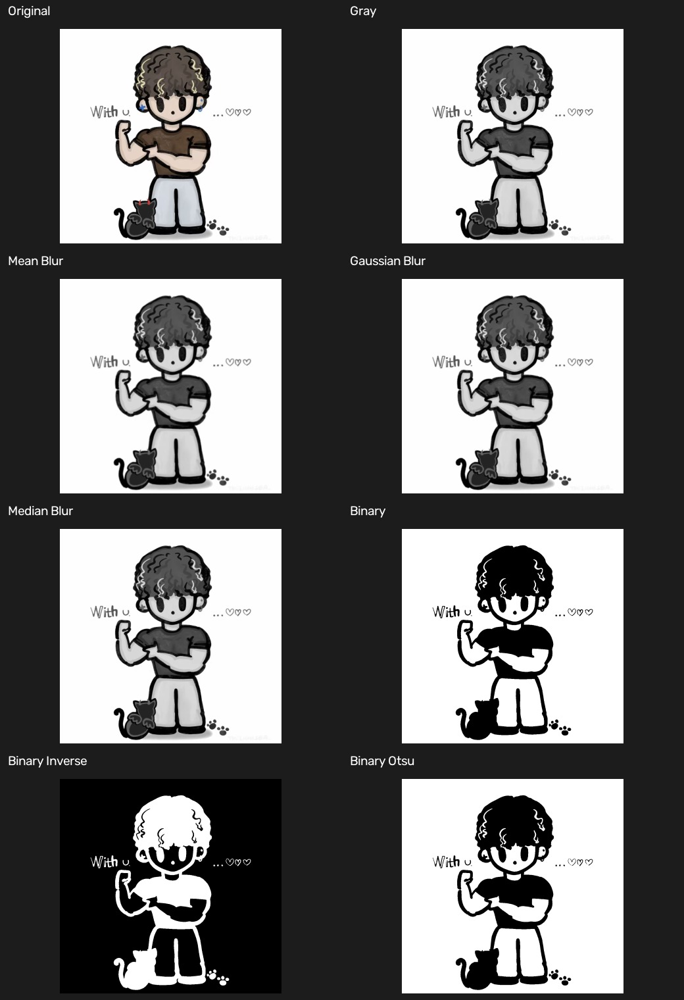

# 05 预处理：边界填充、平滑与阈值

[上一章：数值运算](04-numerical-operations.md) · [教材目录](README.md) · [下一章：形态学基础](06-morphology-basics.md)

## 学习目标与前置知识

- 理解卷积和滤波为什么需要边界填充。
- 区分均值、高斯和中值滤波的适用情况。
- 掌握固定阈值、反向阈值和 Otsu 自动阈值。

前置知识：灰度值范围、图像数组与 BGR 转灰度。

## 核心理论

滤波器要读取一个像素周围的邻域；位于图像边缘的像素没有完整邻域，因此需要向外补值。

```text
原始：  a b c
复制：  a a b c c
常量：  0 a b c 0
反射：  b a b c b
```

本仓库展示了常量填充、边缘复制和 `REFLECT_101` 反射填充。它们会影响边缘附近的滤波结果。

平滑的目标是降低噪声，但会牺牲部分细节：

| 方法 | 核心思路 | 典型用途 |
| --- | --- | --- |
| 均值滤波 | 邻域平均 | 简单随机噪声 |
| 高斯滤波 | 中心权重大、边缘权重小 | 平滑且较自然的去噪 |
| 中值滤波 | 取邻域中位数 | 椒盐噪声、保留边缘 |

二值阈值把灰度图分成两类。对 `THRESH_BINARY`：

$$dst(x,y) = \begin{cases}255, & src(x,y) > T \\ 0, & src(x,y) \le T\end{cases}$$

反向二值阈值正好相反。Otsu 方法会遍历候选阈值，将灰度直方图分为两类，并选择使类间方差最大的阈值；因此在前景和背景灰度分布分离较明显时很有效。

## 图形化理解



这是一条典型的预处理链路：原始图包含颜色、纹理和噪点；平滑后，细小随机变化被减弱；阈值后，只保留黑白两类，为轮廓或形态学操作准备前景与背景。

边界填充发生在“平滑”这一步附近。滤波核移动到图像边缘时，边缘外没有真实像素；`copyMakeBorder()` 按常量、复制或反射规则补出邻域，防止边缘像素没有足够的核覆盖范围。

图：本仓库绘制的概念图。均值、高斯和中值滤波的机制可对照 [OpenCV 官方平滑教程](https://docs.opencv.org/4.x/d4/d13/tutorial_py_filtering.html)。

## 对应实践

对应脚本：[边界填充示例](../border_padding.py) · [阈值与平滑示例](../threshold_smoothing.py)

```powershell
python border_padding.py
python threshold_smoothing.py
```

`border_padding.py` 对同一图像分别应用 `BORDER_CONSTANT`、`BORDER_REPLICATE` 和 `BORDER_REFLECT_101` 并在窗口中对比。`threshold_smoothing.py` 先将图像转灰度并进行均值、高斯、中值滤波，再生成固定阈值、反向阈值和 Otsu 二值图。

输入为 `images/basics/test.jpg`。边界填充结果显示在窗口中；阈值与平滑结果同时显示并保存到 `output/threshold/`。

## 参数速查与常见误区

| 写法 | 作用 |
| --- | --- |
| `cv2.copyMakeBorder(src, top, bottom, left, right, borderType, value)` | 在四边添加像素 |
| `cv2.blur(src, (k, k))` | 均值滤波 |
| `cv2.GaussianBlur(src, (k, k), 0)` | 高斯滤波，`0` 表示自动计算 sigma |
| `cv2.medianBlur(src, k)` | 中值滤波，核大小为正奇数 |
| `cv2.threshold(src, thresh, maxval, type)` | 固定或自动阈值 |
| `cv2.THRESH_BINARY + cv2.THRESH_OTSU` | Otsu 自动选择阈值，`thresh` 通常写 0 |

常见误区：

- 误以为滤波核可以任意尺寸；高斯和中值滤波常用正奇数核，如 `(5, 5)`。
- 用彩色三通道图直接做单一灰度阈值，结果难以解释；本例先转灰度。
- 把 Otsu 当作万能阈值；光照极不均匀时通常要考虑自适应阈值等其他方法。

## 复习卡

关键结论：填充解决边缘邻域不足；滤波用于降噪；阈值把连续灰度分为类别，Otsu 自动选全局阈值。

<details>
<summary>自测 1：为什么滤波前常需要边界填充？</summary>

因为边缘像素缺少完整邻域，滤波器无法直接取得足够的周围像素。
</details>

<details>
<summary>自测 2：哪种滤波通常更适合去除椒盐噪声？</summary>

中值滤波，因为中位数对少量极端噪声值不敏感。
</details>

<details>
<summary>自测 3：使用 Otsu 时为什么常把 <code>thresh</code> 设为 0？</summary>

因为最终阈值由 Otsu 根据图像直方图自动计算，手写的固定阈值不会作为最终阈值使用。
</details>

## 运行结果

第一个拼图比较三种边界填充；第二个拼图按处理顺序展示灰度化、三种平滑、固定阈值、反向阈值和 Otsu 阈值结果。





[上一章：数值运算](04-numerical-operations.md) · [教材目录](README.md) · [下一章：形态学基础](06-morphology-basics.md)
