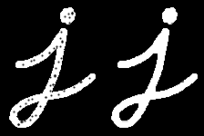
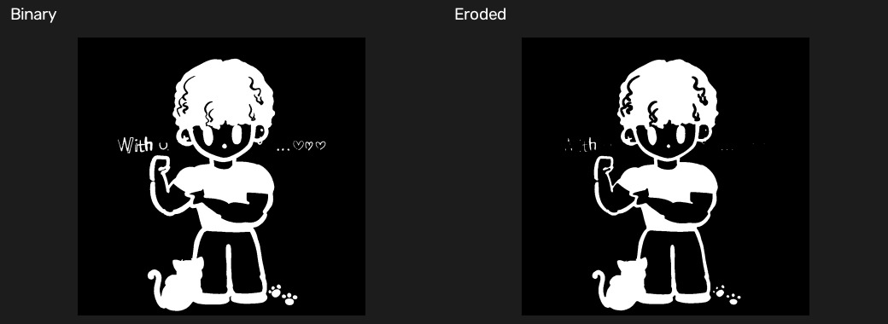
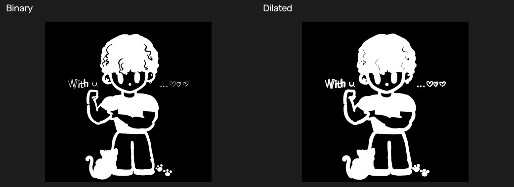
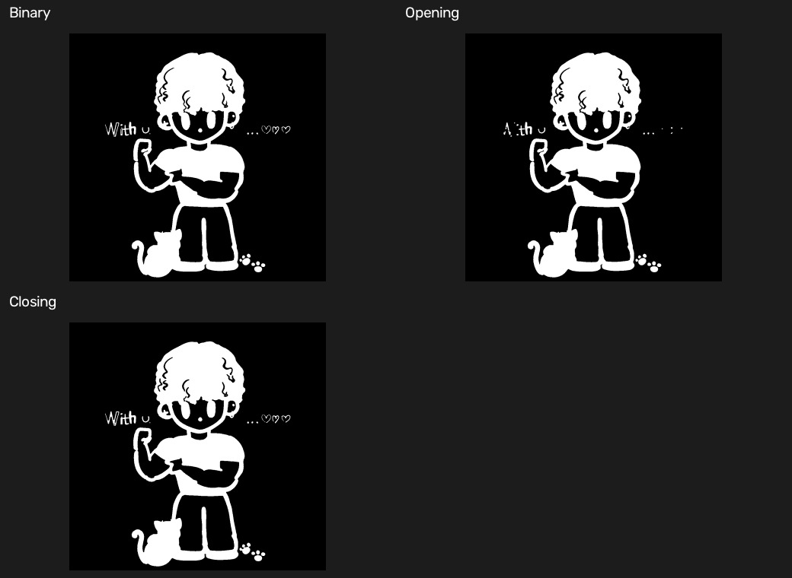

# 06 形态学基础：腐蚀、膨胀、开运算与闭运算

[上一章：预处理](05-preprocessing.md) · [教材目录](README.md) · [下一章：形态学特征](07-morphological-features.md)

## 学习目标与前置知识

- 理解结构元素如何定义局部形状规则。
- 分清二值图前景颜色与腐蚀、膨胀的视觉结果。
- 掌握开运算和闭运算的组合逻辑及应用场景。

前置知识：灰度、阈值和二值图。示例中通过反向阈值使深色主体成为白色前景。

## 核心理论

形态学操作用一个小模板扫描图像，这个模板称为结构元素（kernel）。在二值图里，结果取决于你把白色还是黑色定义为前景。

```text
白色前景：       腐蚀后：         膨胀后：
   #####            ###             #######
   #####            ###             #######
   #####            ###             #######
```

| 操作 | 白色前景的效果 | 常见用途 |
| --- | --- | --- |
| 腐蚀 | 白色区域缩小 | 去除小白噪点、断开细连接 |
| 膨胀 | 白色区域扩大 | 填补小黑孔、连接近邻白区域 |
| 开运算 | 先腐蚀后膨胀 | 去小白噪点、平滑外轮廓 |
| 闭运算 | 先膨胀后腐蚀 | 填小黑孔、连接小裂缝 |

组合关系为：

$$opening = dilation(erosion(image))$$

$$closing = erosion(dilation(image))$$

如果你的二值图中主体是黑色、背景是白色，那么你观察到的“白色变小”可能是黑色主体在视觉上变大；这不是函数出错，而是前景定义与观察颜色不同。

## 图形化理解

| 原始白色前景 | 腐蚀 | 膨胀 |
| --- | --- | --- |
|  |  |  |

上表使用同一个白色字母来观察结构元素的影响：腐蚀要求核覆盖范围内都满足前景条件，因此白色笔画边界向内收缩；膨胀只要核覆盖范围内存在前景，就会把白色扩到周围。

| 开运算 | 闭运算 |
| --- | --- |
|  |  |
| 先缩后扩：小白噪点难以恢复 | 先扩后缩：小黑洞容易被填平 |

图中白色被当作前景。若你的二值图恰好相反，先用 `THRESH_BINARY_INV` 或 `cv2.bitwise_not()` 统一前景定义，再判断“变大”还是“变小”。

图：OpenCV 官方形态学教程示例图，Apache-2.0；本地来源映射见 [配图来源清单](assets/SOURCES.md)，理论可进一步阅读 [OpenCV Morphological Transformations](https://docs.opencv.org/4.x/d9/d61/tutorial_py_morphological_ops.html)。

## 对应实践

对应脚本：[腐蚀示例](../erosion.py) · [膨胀示例](../dilation.py) · [开闭运算示例](../opening_closing.py)

```powershell
python erosion.py
python dilation.py
python opening_closing.py
```

三个脚本均读取 `images/basics/test.jpg`，转灰度、做高斯滤波和 Otsu 反向阈值，随后使用结构元素处理并显示、保存结果。`erosion.py` 与 `dilation.py` 使用 `5 × 5` 矩形结构元素；`opening_closing.py` 使用 `5 × 5` 椭圆结构元素。

## 参数速查与常见误区

| 写法 | 作用 |
| --- | --- |
| `cv2.getStructuringElement(shape, (w, h))` | 创建结构元素 |
| `cv2.MORPH_RECT` | 矩形结构元素 |
| `cv2.MORPH_ELLIPSE` | 椭圆结构元素 |
| `cv2.erode(src, kernel, iterations=1)` | 腐蚀 |
| `cv2.dilate(src, kernel, iterations=1)` | 膨胀 |
| `cv2.morphologyEx(src, cv2.MORPH_OPEN, kernel)` | 开运算 |
| `cv2.morphologyEx(src, cv2.MORPH_CLOSE, kernel)` | 闭运算 |

常见误区：

- 没确认白色是否是前景，就判断“腐蚀/膨胀方向错了”。
- 核尺寸过大，导致细节、文字或细小结构被抹掉。
- 认为开运算和闭运算可以互换；它们的顺序和目的不同。

## 复习卡

关键结论：结构元素是局部形状模板；开是先腐蚀后膨胀；闭是先膨胀后腐蚀；效果要以“前景颜色”判断。

<details>
<summary>自测 1：白色为前景时，腐蚀会让白色区域如何变化？</summary>

白色区域会缩小，细小白噪点可能消失。
</details>

<details>
<summary>自测 2：填补白色物体内部小黑孔，更适合开运算还是闭运算？</summary>

闭运算，因为它先膨胀以填补小孔和裂缝，再腐蚀恢复主体轮廓。
</details>

<details>
<summary>自测 3：为什么形态学前通常先做阈值？</summary>

二值图的前景和背景明确，腐蚀、膨胀的形状变化更容易控制和解释。
</details>

## 运行结果

三个拼图分别对比二值图与腐蚀、膨胀、开运算和闭运算结果。示例中深色主体经过反向阈值后成为白色前景。







[上一章：预处理](05-preprocessing.md) · [教材目录](README.md) · [下一章：形态学特征](07-morphological-features.md)
