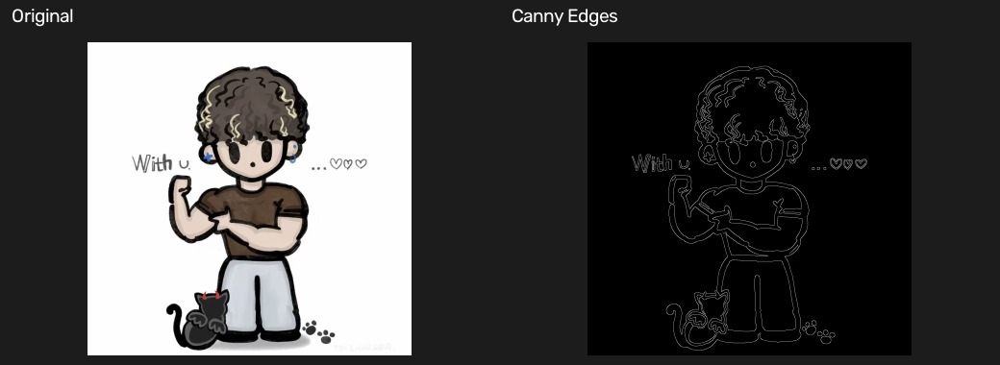

# 09 Canny 边缘检测

[上一章：图像梯度算子](08-image-gradients.md) · [教材目录](README.md) · [下一章：轮廓与几何特征](10-contours-and-geometry.md)

## 学习目标与前置知识

- 理解 Canny 如何从灰度变化中提取细而连续的边缘。
- 明确非极大值抑制为什么能把宽边缘压成细线。
- 掌握双阈值与边缘连接如何平衡噪声和边缘连续性。

前置知识：高斯滤波、Sobel 梯度、梯度幅值和梯度方向。

## 核心理论

Canny 是一套完整的边缘检测流程，而不是只计算一次梯度：

```text
BGR image
    ↓ grayscale
Gray image
    ↓ Gaussian blur
Noise-reduced image
    ↓ Sobel gradient
Magnitude + direction
    ↓ non-maximum suppression
Thin edges
    ↓ double threshold + hysteresis
Final binary edges
```

对灰度图 $I(x, y)$，Sobel 算子计算水平方向和垂直方向的变化：

$$G_x = \frac{\partial I}{\partial x}, \qquad G_y = \frac{\partial I}{\partial y}$$

传统的梯度幅值和方向为：

$$G = \sqrt{G_x^2 + G_y^2}, \qquad \theta = \operatorname{atan2}(G_y, G_x)$$

梯度箭头以当前像素为起点，指向亮度增加最快的方向；它与边缘走向垂直。

上式用于直观说明梯度幅值和方向；本示例没有传入 `L2gradient=True`，因此 `cv2.Canny` 使用默认的快速幅值近似。只有显式设置 `L2gradient=True` 时，OpenCV 才使用上述平方和开根号的幅值计算。

```text
dark region | bright region
            → gradient direction
     vertical edge direction
```

非极大值抑制沿梯度方向比较当前像素两侧的梯度幅值，只保留局部最大值。例如，当前方向近似水平时比较左、右邻居：

```text
Before NMS:  20   80  120   90   30
After NMS:    0    0  120    0    0
```

因此，原本有宽度的边缘响应会收缩为细线。实际实现常将方向近似分为 `0°`、`45°`、`90°`、`135°`，分别与对应方向的两个邻居比较。

双阈值将非极大值抑制后的像素分为三类：

| 梯度幅值 | 分类 | 处理 |
| --- | --- | --- |
| `> highThreshold` | 强边缘 | 直接保留 |
| `lowThreshold` 到 `highThreshold` | 弱边缘 | 仅在连接到强边缘时保留 |
| `< lowThreshold` | 非边缘 | 丢弃 |

```text
20     70     180    100    30
drop   weak   strong weak   drop
```

最后的边缘连接（hysteresis）会检查弱边缘的 8 邻域：能通过相邻弱边缘连到强边缘的部分被保留；孤立的弱边缘被删除。单阈值容易在“噪声很多”和“边缘断裂”之间二选一，双阈值则同时控制这两个问题。

## 对应实践

对应脚本：[Canny 边缘检测示例](../Canny_test.py)

在仓库根目录运行：

```powershell
python Canny_test.py
```

脚本依次完成：读取 `images/test.jpg`、转换为灰度图、使用 `5 × 5` 高斯核降噪、调用 `cv2.Canny`，最后显示原始 BGR 图和二值边缘图。

核心调用：

```python
edges = cv2.Canny(blur, 50, 150)
```

其中 `edges` 是单通道图像：白色像素为最终边缘，黑色像素为背景。该脚本仅显示结果，不写入 `output/`。

## 参数速查与常见误区

| 写法 | 作用 |
| --- | --- |
| `cv2.GaussianBlur(gray, (5, 5), 0)` | 在检测前降噪，减少伪边缘 |
| `cv2.Canny(src, lowThreshold, highThreshold)` | 执行 Canny 边缘检测 |
| `50` | 低阈值；低于它的响应被丢弃 |
| `150` | 高阈值；高于它的响应作为强边缘保留 |
| `L2gradient=True` | 使用 $\sqrt{G_x^2+G_y^2}$ 计算梯度幅值；默认使用更快的近似 |

常见误区：

- 直接对彩色图做边缘检测；本示例先转灰度，便于统一解释亮度变化。
- 跳过高斯滤波；噪声的快速变化也会被当作边缘。
- 将低阈值和高阈值设得相同；会失去弱边缘连接的意义。
- 认为所有弱边缘都会保留；只有与强边缘连通的弱边缘才会留下。

## 复习卡

关键结论：Canny 先降噪、计算梯度，再细化和筛选边缘；非极大值抑制负责“变细”，双阈值与边缘连接负责“保真并去噪”。

<details>
<summary>自测 1：非极大值抑制比较的是哪一个方向上的邻居？</summary>

比较梯度方向上的两个邻居，因为梯度方向是亮度变化最快的方向，也是垂直穿过边缘的方向。
</details>

<details>
<summary>自测 2：为什么梯度为 70 的弱边缘不能立刻作为最终边缘保留？</summary>

它可能是真实边缘较弱的一段，也可能只是噪声；只有它与强边缘连通时，Canny 才保留它。
</details>

<details>
<summary>自测 3：将 50/150 改为 20/60，通常会有什么变化？</summary>

会检测到更多边缘，但更容易把纹理和噪声保留为伪边缘；实际效果取决于图像对比度和噪声程度。
</details>

## 运行结果

拼图展示原始图和 Canny 最终输出的二值边缘图。



[上一章：图像梯度算子](08-image-gradients.md) · [教材目录](README.md) · [下一章：轮廓与几何特征](10-contours-and-geometry.md)
