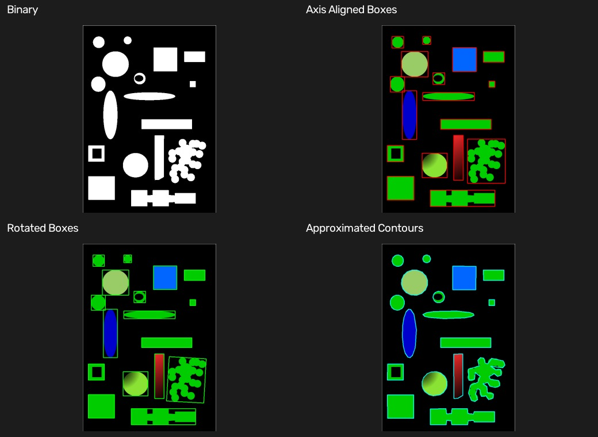

# 10 轮廓与几何特征

[上一章：Canny 边缘检测](09-canny-edge-detection.md) · [教材目录](README.md) · [下一章：模板匹配](11-template-matching.md)

## 学习目标与前置知识

- 区分边缘图与轮廓点集合。
- 使用轮廓面积筛选主要目标。
- 理解普通边界矩形、最小旋转矩形与轮廓近似。

前置知识：灰度图、阈值、Canny 和 NumPy 图像数组。

## 核心理论

边缘检测回答“哪里有亮度突变”；轮廓检测回答“哪些白色前景像素围成一个目标”。

```text
Gray image -> Canny -> edge pixels
Gray image -> threshold -> white foreground -> contour point set
```

对一条轮廓 `contour`，可以计算面积、周长和外接框：

| 几何量 | 函数 | 含义 |
| --- | --- | --- |
| 面积 | `cv2.contourArea` | 轮廓包围区域的像素面积 |
| 周长 | `cv2.arcLength` | 封闭轮廓的边界长度 |
| 普通矩形 | `cv2.boundingRect` | 与图像坐标轴平行的外接框 |
| 旋转矩形 | `cv2.minAreaRect` | 允许旋转、面积更小的外接框 |
| 轮廓近似 | `cv2.approxPolyDP` | 用更少关键顶点描述轮廓 |

轮廓近似的误差常按周长比例设置：

$$epsilon = rate \times perimeter$$

`rate` 越小，近似线条越贴近真实边界；过小则会保留像素锯齿。多个相互接触的圆在二值图中会连成一个前景区域，降低 `epsilon` 不能把它们自动分开。

## 对应实践

对应脚本：[边缘与轮廓对比](../edge_contour_compare.py) · [轮廓几何示例](../contour_geometry.py)

```powershell
python edge_contour_compare.py
python contour_geometry.py
```

第一个脚本在 `test.jpg` 上对比 Canny、二值前景和轮廓。第二个脚本在 `geometric_shapes.png` 上筛选面积不少于 200 的轮廓，使用 `0.005 × perimeter` 作为近似误差，并显示三种几何结果。

## 参数速查与常见误区

| 写法 | 作用 |
| --- | --- |
| `cv2.RETR_EXTERNAL` | 仅提取最外层轮廓 |
| `cv2.CHAIN_APPROX_SIMPLE` | 压缩共线边界点 |
| `cv2.boundingRect(contour)` | 返回 `x, y, width, height` |
| `cv2.minAreaRect(contour)` | 返回中心、宽高和旋转角 |
| `cv2.boxPoints(rect)` | 将旋转矩形转为四个顶点 |
| `cv2.approxPolyDP(contour, epsilon, True)` | 近似封闭轮廓 |

常见误区：

- 将边缘图直接当作完整物体区域；边缘可能断裂且包含纹理。
- 以为普通边界矩形会随目标旋转；它永远水平、垂直。
- 以为减小 `epsilon` 能分离粘连目标；分离需要形态学、距离变换或分水岭等方法。

## 复习卡

关键结论：轮廓来自二值前景；边界矩形是轮廓的几何描述；轮廓近似通过 `epsilon` 控制简化程度。

<details>
<summary>自测 1：普通边界矩形和最小旋转矩形的主要区别是什么？</summary>

普通边界矩形与坐标轴平行；最小旋转矩形可旋转，更贴合倾斜目标。
</details>

<details>
<summary>自测 2：为什么要按面积过滤轮廓？</summary>

小噪点、文字和碎片也会形成轮廓；面积过滤可保留更可能是目标的区域。
</details>

<details>
<summary>自测 3：将 <code>epsilon</code> 从 <code>0.02 × perimeter</code> 降到 <code>0.005 × perimeter</code>，通常会发生什么？</summary>

会保留更多顶点，轮廓更贴合原始边界，也可能保留更多锯齿细节。
</details>

## 运行结果

第一个拼图按原图、Canny 边缘图、二值前景和轮廓分析的顺序对比；第二个拼图按二值图、普通矩形、旋转矩形和近似轮廓的顺序展示规则图形。




[上一章：Canny 边缘检测](09-canny-edge-detection.md) · [教材目录](README.md) · [下一章：模板匹配](11-template-matching.md)
