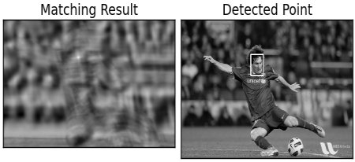
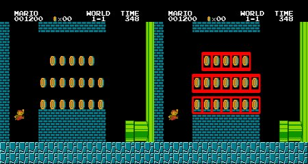
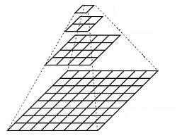
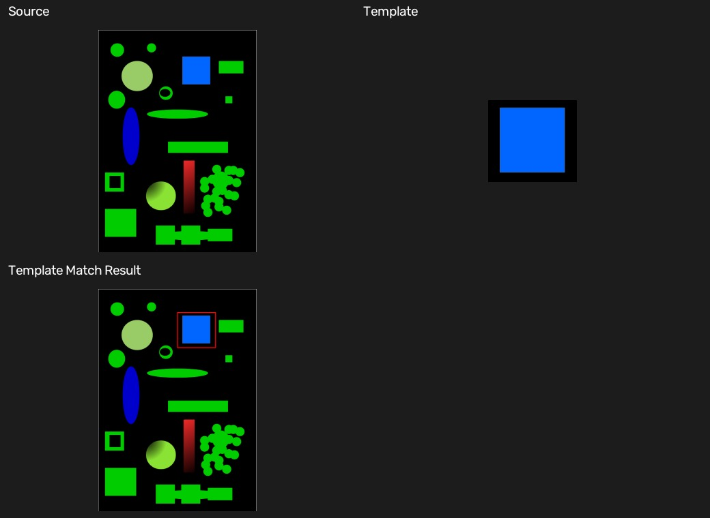

# 11 模板匹配

[上一章：轮廓与几何特征](10-contours-and-geometry.md) · [教材目录](README.md) · [下一章：灰度直方图](12-gray-histogram.md)

## 学习目标与前置知识

- 理解模板在大图上逐位置比较的过程。
- 使用匹配得分图和最佳位置定位模板。
- 知道模板匹配对旋转、缩放和遮挡的限制。

前置知识：图像切片、灰度化、矩形绘制。

## 核心理论

模板匹配用小图 `template` 在大图 `source` 上滑动，计算每个位置的相似度：

```text
source image + template
        ↓ slide and compare
score map
        ↓ choose best score
best location
```

本例使用 `TM_CCOEFF_NORMED`。它的得分越接近 1，当前位置与模板越相似。`minMaxLoc` 返回得分图的最小值、最大值及其坐标；对于该方法，应取最大值位置。

模板的左上角为 `(x, y)`，宽高为 `(w, h)`，匹配框为：

```text
top_left     = (x, y)
bottom_right = (x + w, y + h)
```

基础模板匹配假设模板和目标的大小、方向基本相同。目标旋转、缩放、遮挡或光照变化较大时，分数会下降。

## 图形化理解

| 匹配得分图 | 最佳位置结果 |
| --- | --- |
|  |  |
| 每一个像素对应“模板左上角放在这里时”的相似度。对 `TM_CCOEFF_NORMED`，越亮通常表示分数越高。 | `minMaxLoc()` 找到得分最高的位置后，以模板宽高画出最终矩形。 |

得分图的宽高不是原图大小，而是：

$$score\_width = W-w+1, \qquad score\_height = H-h+1$$

因为模板的左上角只能落在不越出源图边界的位置。右图的矩形框不是检测模型直接输出的框，而是“最佳得分位置 + 已知模板尺寸”计算得到的。

### 多尺度扩展：图像金字塔



图像金字塔把同一图像表示为从大到小的多个尺度层级。通常每向上一层先平滑再下采样，宽高约减半；因此较小层更适合快速粗搜索，较大层再做精细定位。基础 `matchTemplate()` 本身不自动处理缩放，但可以在多个金字塔层或多个缩放版本上分别匹配，从而缓解“目标大小与模板不同”的问题。

图：OpenCV 官方模板匹配与图像金字塔教程示例图，Apache-2.0；本地来源映射见 [配图来源清单](assets/SOURCES.md)，可继续阅读 [OpenCV Template Matching](https://docs.opencv.org/4.x/d8/dd1/tutorial_js_template_matching.html) 和 [OpenCV Image Pyramids](https://docs.opencv.org/4.x/d4/d1f/tutorial_pyramids.html)。

## 对应实践

对应脚本：[模板匹配示例](../template_matching.py)

```powershell
python template_matching.py
```

脚本从 `geometric_shapes.png` 裁剪蓝色矩形及其黑色边缘作为模板，在同一张大图中匹配。由于模板来自原图且没有缩放、旋转，最佳得分应接近 `1.0`，红色矩形标记最佳位置。

## 参数速查与常见误区

| 写法 | 作用 |
| --- | --- |
| `source[y1:y2, x1:x2]` | 裁剪模板区域，注意 y 在前、x 在后 |
| `cv2.matchTemplate(source, template, method)` | 生成匹配得分图 |
| `cv2.TM_CCOEFF_NORMED` | 归一化相关系数，得分越大越好 |
| `cv2.minMaxLoc(score_map)` | 找到得分的极值及其位置 |
| `cv2.rectangle` | 在最佳匹配位置绘制框 |

常见误区：

- 对 `TM_CCOEFF_NORMED` 取最小值位置；该方法应取最大值位置。
- 模板尺寸大于源图，匹配无法进行。
- 以为模板匹配天然支持旋转和缩放；基础函数不支持，需要多尺度或多角度匹配。

## 复习卡

关键结论：模板匹配产生得分图；不同方法决定取最大值还是最小值；基础模板匹配只适合外观与尺度接近的目标。

<details>
<summary>自测 1：为什么本例的最佳得分接近 1？</summary>

模板直接从同一张源图裁剪，目标位置的尺寸、角度和像素外观完全一致。
</details>

<details>
<summary>自测 2：<code>top_left</code> 和 <code>bottom_right</code> 如何得到？</summary>

`top_left` 是最佳位置；右下角等于左上角分别加上模板宽度和高度。
</details>

<details>
<summary>自测 3：模板中的物体旋转 45 度后，基础匹配为什么可能失败？</summary>

逐像素外观不再与原模板对齐，相似度会明显降低。
</details>

## 运行结果

拼图显示源图、裁剪出的蓝色矩形模板和红色最佳匹配框。



[上一章：轮廓与几何特征](10-contours-and-geometry.md) · [教材目录](README.md) · [下一章：灰度直方图](12-gray-histogram.md)
