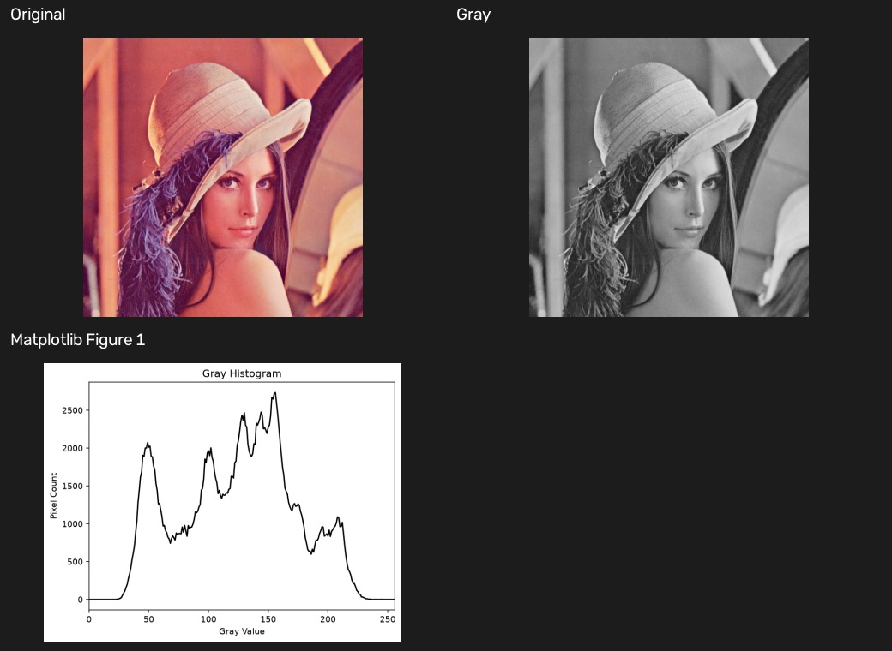

# 12 灰度直方图

[上一章：模板匹配](11-template-matching.md) · [教材目录](README.md) · [返回仓库首页](../README.md)

## 学习目标与前置知识

- 理解直方图统计的是像素值出现次数，而不是像素位置。
- 会读取灰度直方图的横轴、纵轴和分布范围。
- 使用 `cv2.calcHist` 统计 0 到 255 的灰度值。

前置知识：灰度图、像素范围、Matplotlib 基本绘图。

## 核心理论

灰度直方图将每个灰度值出现的次数统计为一个柱或一个曲线点：

```text
x axis: gray value 0 ------------------------- 255
y axis: number of pixels with that gray value
```

它不保留像素坐标。例如两张像素排列不同、但灰度值数量相同的图，直方图可能完全一样。

| 分布特征 | 常见解释 |
| --- | --- |
| 峰值集中在左侧 | 图像整体偏暗 |
| 峰值集中在右侧 | 图像整体偏亮 |
| 分布范围较窄 | 对比度较低 |
| 分布范围较宽 | 明暗差异较大 |
| 两个明显峰值 | 前景和背景可能适合阈值分割 |

本例以 256 个 bin 统计 8 位灰度图，因此每个 bin 对应一个灰度值。

## 对应实践

对应脚本：[灰度直方图示例](../histogram_gray.py)

```powershell
python histogram_gray.py
```

脚本读取 `lena_portrait.png`，转换为灰度图，再以 `cv2.calcHist` 统计直方图，并用 Matplotlib 绘制曲线。

```python
hist = cv2.calcHist([gray], [0], None, [256], [0, 256])
```

## 参数速查与常见误区

| 参数 | 当前值 | 含义 |
| --- | --- | --- |
| `images` | `[gray]` | 输入图像列表 |
| `channels` | `[0]` | 灰度图的第 0 个通道 |
| `mask` | `None` | 统计整张图，不限制 ROI |
| `histSize` | `[256]` | 使用 256 个统计区间 |
| `ranges` | `[0, 256]` | 覆盖实际灰度值 0 到 255 |

常见误区：

- 把直方图当成图像轮廓；它没有空间位置关系。
- 以为直方图范围宽就一定“更好”；是否合适取决于任务和曝光情况。
- 对 BGR 彩色图直接按灰度图的单通道方式解释；彩色图需要分别统计三个通道。

## 复习卡

关键结论：直方图描述像素值分布；左侧偏暗、右侧偏亮；`calcHist` 的 256 个 bin 对应 8 位灰度图的 256 个可能值。

<details>
<summary>自测 1：灰度值 0 和 255 分别代表什么？</summary>

0 代表黑色，255 代表白色。
</details>

<details>
<summary>自测 2：为什么两张不同图片可能有相同直方图？</summary>

直方图只统计每种灰度值的数量，不记录这些像素位于哪里。
</details>

<details>
<summary>自测 3：直方图大部分集中在 0 到 60，通常说明什么？</summary>

通常说明图像中暗像素很多，整体偏暗。
</details>

## 运行结果

拼图显示原始人像、灰度图和对应的灰度直方图曲线。



[上一章：模板匹配](11-template-matching.md) · [教材目录](README.md) · [返回仓库首页](../README.md)
