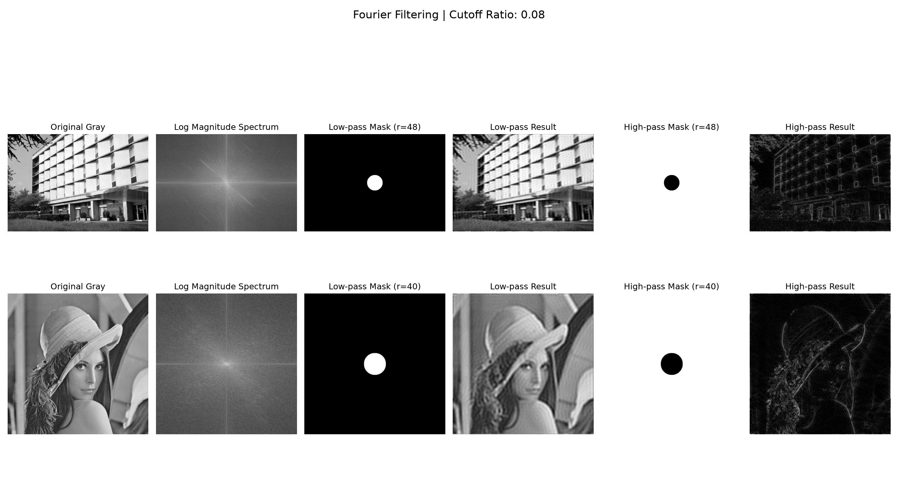

# 13 傅里叶变换与频域滤波

[上一章：灰度直方图](12-gray-histogram.md) · [教材目录](README.md) · [下一章：银行卡号模板匹配实战](14-card-number-template-matching.md)

## 学习目标与前置知识

- 区分空间域与频域，理解低频、高频、频谱与掩膜。
- 使用 FFT、频谱中心移位、低通掩膜和高通掩膜完成频域滤波。
- 能解释截止比例变大或变小时，低通和高通结果为何变化。

前置知识：灰度图、NumPy 数组、归一化、图像平滑。

## 核心理论

空间域直接处理像素值；频域则把图像拆成不同频率的变化成分：

```text
灰度图
  ↓ FFT
复数频谱（幅度 + 相位）
  ↓ 频域掩膜
过滤后的频谱
  ↓ IFFT
新的空间域图像
```

低频表示缓慢变化的大面积亮暗关系，例如建筑轮廓、脸部整体明暗；高频表示快速变化，例如边缘、头发、砖墙纹理，也可能包含噪声。

`np.fft.fft2()` 的零频分量默认位于数组角落。`np.fft.fftshift()` 只改变频谱的排列位置，把低频移到中心，便于用“以中心为圆心”的掩膜操作：

```text
未移位：低频在四角
移位后：低频在中心，越靠外频率越高
```

频谱是复数，通常显示其对数幅度谱：

```python
magnitude = 20 * np.log1p(np.abs(shifted))
```

`np.abs()` 取幅度；`log1p` 压缩极大的数值范围，使低频和高频都能在同一张图上看清。

### 圆形掩膜

本章以图像中心为圆心、`cutoff` 为半径创建两张掩膜：

```text
低通掩膜：圆内为 1，圆外为 0 → 保留低频 → 图像变模糊
高通掩膜：圆内为 0，圆外为 1 → 保留高频 → 突出边缘与细节
```

低通结果仍是亮度图；高通结果包含正负细节值，显示前需要取绝对值并归一化。高频不等于“重要目标”，它也可能是噪声。

## 对应实践

对应脚本：[fourier_filter.py](../fourier_filter.py)

```powershell
python fourier_filter.py
```

脚本处理以下两张图片：

- `images/frequency/building_facade.png`：观察规则窗格、建筑轮廓与方向性频率。
- `images/frequency/lena_portrait.png`：观察低通后的皮肤平滑、细节丢失，以及高通后的头发和轮廓。

脚本使用：

```python
CUTOFF_RATIO = 0.08
cutoff = int(min(height, width) * CUTOFF_RATIO)
```

若只生成文档结果、不打开窗口：

```powershell
python fourier_filter.py --save-only
```

## 参数速查与常见误区

| 写法 | 含义 |
| --- | --- |
| `np.fft.fft2(gray)` | 对二维灰度图做正向傅里叶变换 |
| `np.fft.fftshift(spectrum)` | 将低频移到频谱中心，便于观察和创建圆形掩膜 |
| `CUTOFF_RATIO` | 截止半径占较短边的比例 |
| `shifted * low_mask` | 在频域保留低频 |
| `np.fft.ifft2(...)` | 将过滤后的频谱逆变换回图像 |

常见误区：

- 忘记在逆变换前调用 `ifftshift()`，频谱顺序会错误。
- 直接显示高通浮点结果，画面可能偏黑或难以辨认；应取绝对值并归一化。
- 认为低通就是“更清晰”；低通本质上会丢失细节。
- 以为图像内容只由幅度决定；相位同样非常重要。

## 复习卡

关键结论：FFT 将空间域图像表示为频率成分；低通保留整体变化，高通保留快速变化；`fftshift` 是为了让中心圆形掩膜的含义直观且实现简单。

<details>
<summary>自测 1：为什么低频要移到中心？</summary>

原始 FFT 的低频位于数组角落。移到中心后，可以直接按照“离中心的距离”创建圆形低通或高通掩膜。
</details>

<details>
<summary>自测 2：截止比例从 0.08 调到 0.04，低通结果会怎样？</summary>

保留的低频范围更小，细节丢失更多，因此图像会更模糊。
</details>

<details>
<summary>自测 3：高通结果为什么也可能突出噪声？</summary>

噪声通常也是快速变化的像素成分，因此同样属于高频。
</details>

## 运行结果

结果拼图按两行展示建筑和人像：原灰度图、对数幅度谱、低通掩膜、低通结果、高通掩膜和高通结果。



[上一章：灰度直方图](12-gray-histogram.md) · [教材目录](README.md) · [下一章：银行卡号模板匹配实战](14-card-number-template-matching.md)
