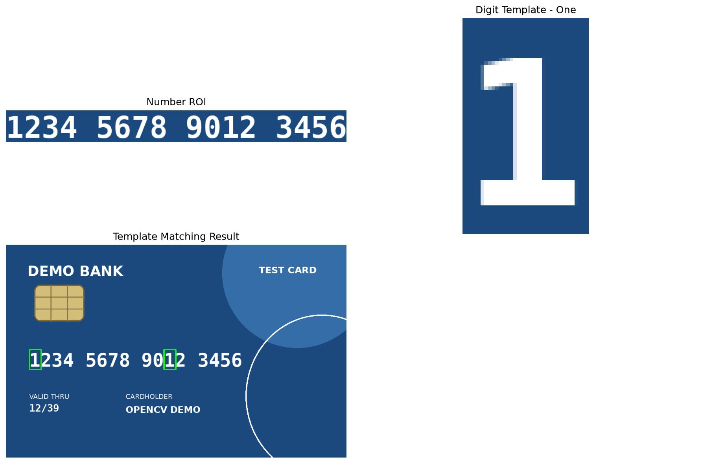
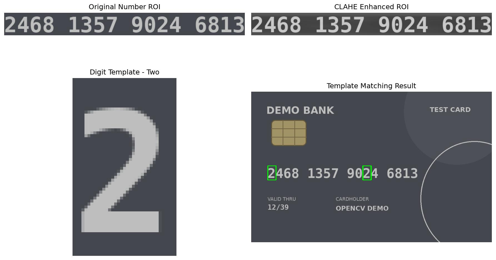
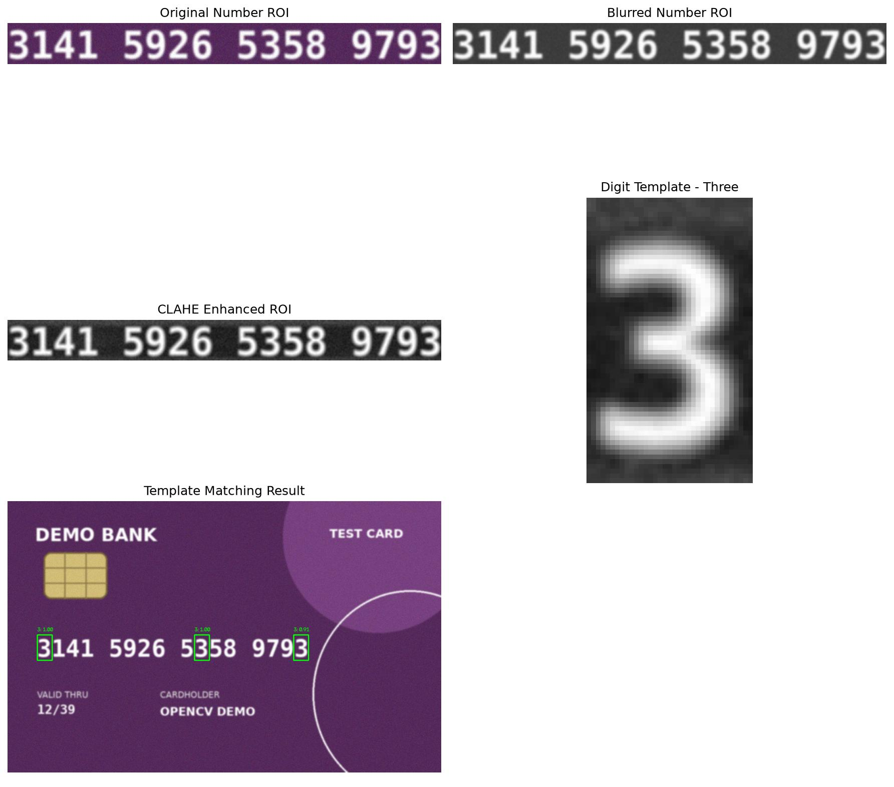
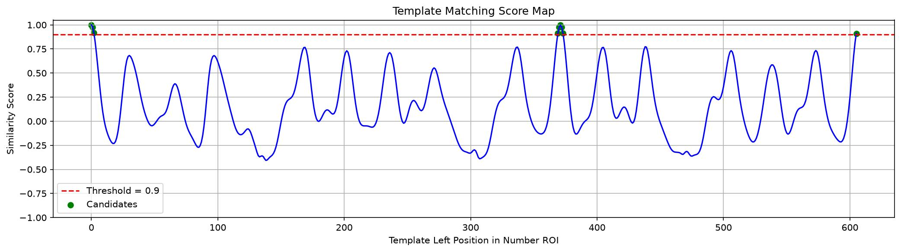
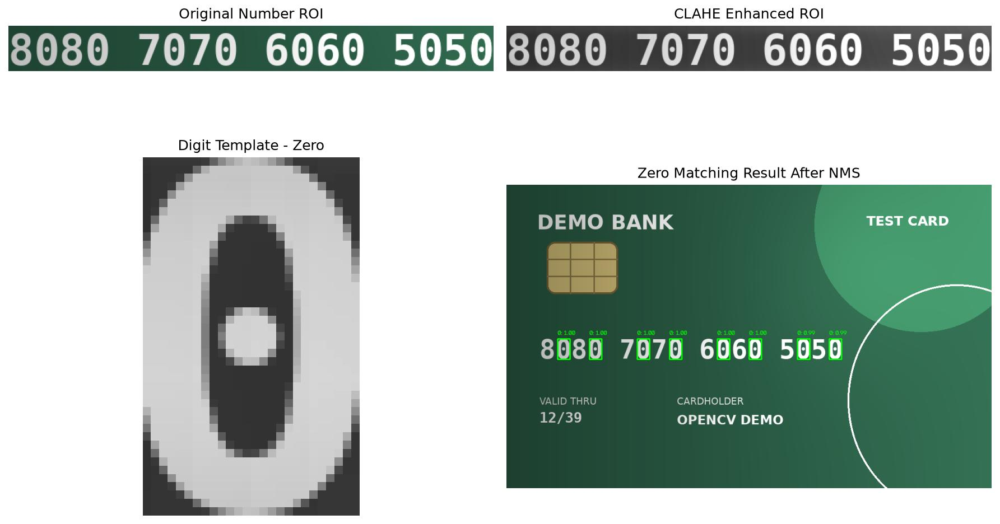
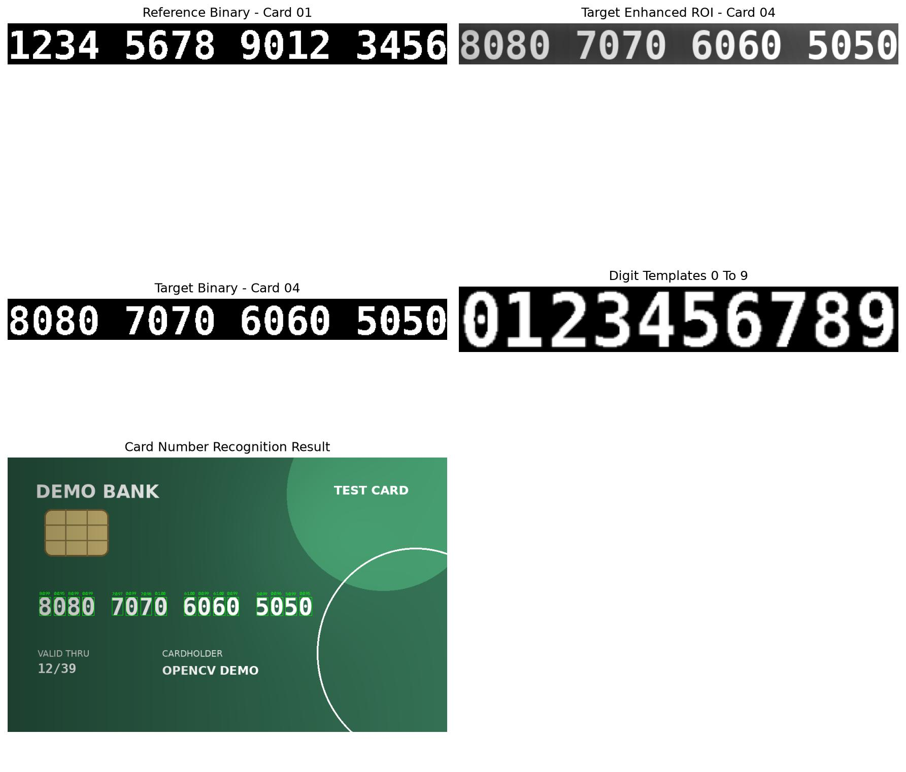
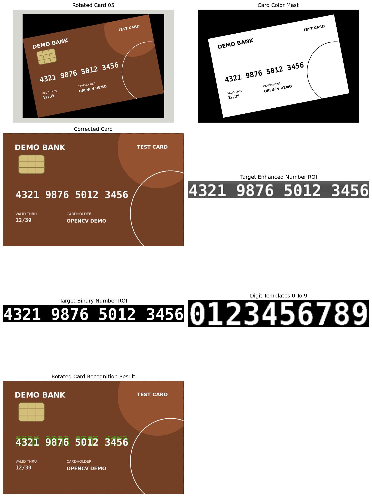

# 14 银行卡号模板匹配实战

[上一章：傅里叶变换与频域滤波](13-fourier-transform.md) · [教材目录](README.md) · [返回仓库首页](../README.md)

## 学习目标与前置知识

- 将模板匹配、CLAHE、阈值、轮廓、NMS 和透视校正组合为完整流程。
- 理解得分图、匹配阈值、IoU 和候选框去重。
- 区分“传统模板匹配识别”与 OCR 模型识别。

前置知识：ROI、灰度化、二值化、轮廓、模板匹配、透视变换。

> 本章所有银行卡号码均为无效演示数据，仅用于图像处理练习；不要将真实银行卡照片上传到公开仓库。

## 核心理论

### 从单个模板到完整号码

```text
银行卡图像
  ↓ 裁出或校正卡号 ROI
灰度化 / CLAHE / 去噪 / 二值化
  ↓
数字模板匹配或轮廓分割
  ↓
候选框去重（NMS）或逐位分类
  ↓
输出号码与每位匹配分数
```

`cv2.matchTemplate()` 让小模板在大图上逐位置滑动，输出 `score_map`。本章采用 `cv2.TM_CCOEFF_NORMED`：分数越接近 `1`，局部亮度结构越相似。`np.where(score_map >= threshold)` 会取得所有高分候选位置。

### 候选框去重：NMS

同一数字附近常出现多个高分框。NMS 先保留最高分框，再删除与它重叠过多的低分框。重叠程度使用 IoU：

```text
IoU = 交集面积 / 并集面积
```

IoU 大于阈值时，两个框通常视为同一个目标；本章使用 `0.30` 作为演示阈值。

### 从“找数字”到“读出号码”

完整号码识别不再只找一个数字：先用轮廓将 16 个数字切开，再将每个数字补边、缩放到相同大小，最后与 `0` 到 `9` 的模板逐一比较，取最高分数字。这里的模板库由清晰的 `card_01_clean.png` 建立。

### 旋转银行卡的校正

对于 `card_05_rotated.png`，先根据高饱和度区域找到卡片主体，得到四个角点，再通过 `cv2.getPerspectiveTransform()` 与 `cv2.warpPerspective()` 映射为标准正面尺寸。校正后，卡号 ROI 的相对坐标才能继续复用。

这仍不是 OCR：当前程序依赖固定布局、已知模板和演示图风格。遇到未知字体、缩放、复杂背景、强透视或没有模板库的真实场景，应使用 PaddleOCR 等 OCR 系统。

## 对应实践

| 难度 | 脚本 | 重点 |
| --- | --- | --- |
| 1 | [card_template_matching.py](../card_template_matching.py) | 清晰卡片、单个数字 `1`、得分阈值 |
| 2 | [card_low_contrast_matching.py](../card_low_contrast_matching.py) | CLAHE 增强低对比度卡号 |
| 3 | [card_blur_noise_matching.py](../card_blur_noise_matching.py) | 高斯滤波、得分曲线、NMS |
| 4 | [card_uneven_light_matching.py](../card_uneven_light_matching.py) | 不均匀光照、IoU 去重 |
| 5 | [card_number_recognition.py](../card_number_recognition.py) | 0–9 模板库、轮廓分割、完整号码输出 |
| 6 | [card_rotated_recognition.py](../card_rotated_recognition.py) | 卡片定位、旋转校正、完整号码识别 |

在项目根目录运行任一示例：

```powershell
python card_rotated_recognition.py
```

重新生成文档结果、但不显示窗口：

```powershell
python card_rotated_recognition.py --save-only
```

输入图像位于 `images/card_template_matching/`。`card_06_perspective.png` 已按主题归类，但暂未有对应脚本，会在后续的透视校正学习中使用。

## 参数速查与常见误区

| 参数或函数 | 作用 |
| --- | --- |
| `clipLimit=2.0` | 限制 CLAHE 的局部对比度增强强度 |
| `tileGridSize=(8, 8)` | 将图像分为 8×8 个局部区域处理 |
| `MATCH_THRESHOLD=0.90` | 只保留分数不低于 0.90 的模板匹配候选位置 |
| `NMS_IOU_THRESHOLD=0.30` | 超过该重叠程度的候选框会被去重 |
| `cv2.RETR_EXTERNAL` | 只取数字外轮廓，避免数字内部孔洞被单独当作目标 |
| `cv2.getPerspectiveTransform` | 由四对角点计算平面校正映射 |

常见误区：

- 把 `score_map` 的位置当作原图坐标；它相对于当前搜索 ROI，需要加回 ROI 左上角。
- 以为高阈值一定更好；阈值太高会漏检，太低会产生大量重复候选框。
- 不统一模板与待识别数字尺寸；逐像素比较会失去意义。
- 认为校正后一定能识别；卡片定位、二值化和轮廓筛选都可能失败。

## 复习卡

关键结论：模板匹配输出的是位置分数图；NMS 用 IoU 删除同一目标周围的重复框；完整号码识别需要数字分割、统一尺寸和 0–9 模板库；旋转图像要先校正再复用 ROI。

<details>
<summary>自测 1：为什么匹配阈值低时候选框会很多？</summary>

较低阈值会接受更多“有一点相似”的位置，其中包含同一数字附近的重复框和错误位置。
</details>

<details>
<summary>自测 2：NMS 为什么总是先保留最高分框？</summary>

在多个高度重叠的候选框中，最高分框最可能准确定位目标，应作为保留基准。
</details>

<details>
<summary>自测 3：为什么 card05 要先做卡片校正？</summary>

旋转后卡号不再位于固定水平 ROI，且数字外观会倾斜；校正为标准正面后才能稳定分割和匹配。
</details>

## 运行结果

### 1. 清晰卡片：数字 1 的基础匹配



### 2. 低对比度：CLAHE 增强后匹配数字 2



### 3. 模糊噪声：数字 3、NMS 与得分曲线





### 4. 不均匀光照：数字 0 的 NMS 去重



### 5. 完整号码：0–9 模板库识别 card04



### 6. 旋转卡片：校正后识别 card05



[上一章：傅里叶变换与频域滤波](13-fourier-transform.md) · [教材目录](README.md) · [返回仓库首页](../README.md)
